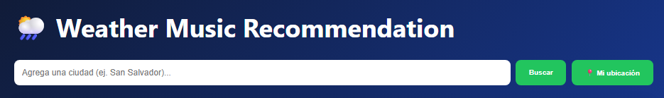
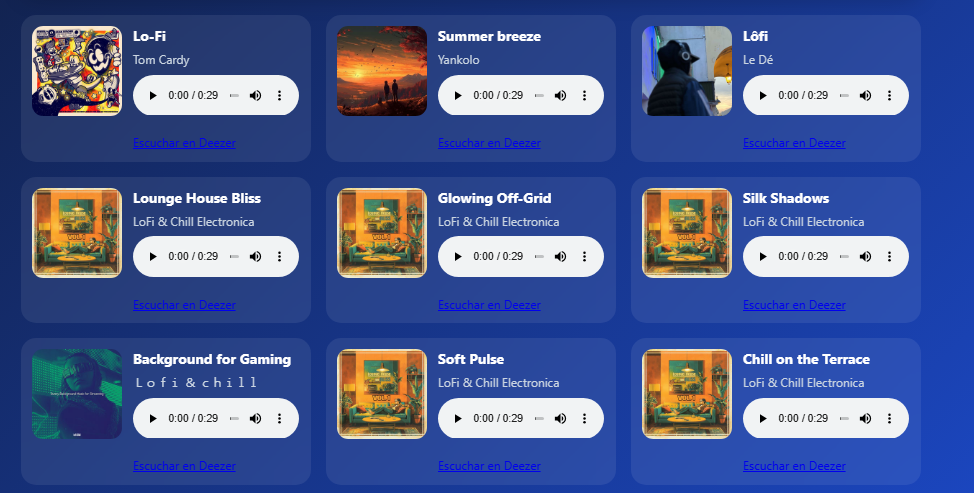
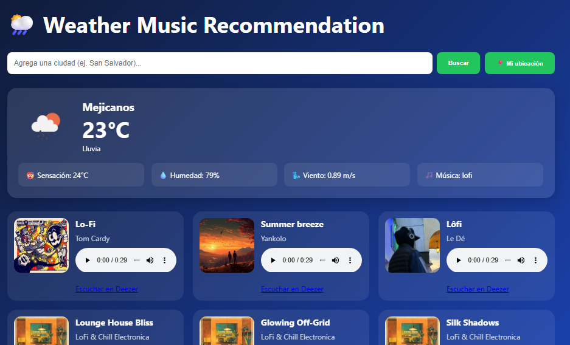

# 🌦️ Weather Music App


Aplicación web que recomienda música basada en las condiciones climáticas actuales utilizando OpenWeather y Deezer.

---

## 🌐 Demo Online

🔗 **Aplicación en producción:**

https://TU-APP.onrender.com

> Reemplaza esta URL cuando publiques el proyecto en Render.

---

## 📸 Capturas de Pantalla

### Pantalla principal



### Recomendaciones musicales



### Geolocalización automática



---

## 🚀 Características

✅ Consulta clima en tiempo real

✅ Geolocalización automática

✅ Recomendación musical según el clima

✅ Reproducción de previews de canciones

✅ Información meteorológica detallada

✅ Fondos dinámicos según las condiciones climáticas

✅ Manejo de errores

✅ Diseño moderno y responsive

---

## 🛠️ Tecnologías Utilizadas

### Backend

* Node.js
* Express
* Axios
* dotenv

### Frontend

* HTML5
* CSS3
* JavaScript

### APIs

* OpenWeather API
* Deezer API

---

## ⚙️ Instalación

### Clonar repositorio

```bash
git clone https://github.com/TU-USUARIO/weather-deezer-app.git
cd weather-music-app
```

### Instalar dependencias

```bash
npm install
```

### Configurar variables de entorno

Crear archivo `.env`

```env
WEATHER_API_KEY=TU_API_KEY
```

### Ejecutar proyecto

```bash
node server.js
```

Abrir:

```text
http://localhost:3000
```

---

## 📂 Estructura del Proyecto

```text
weather-music-app/
│
├── public/
│   ├── index.html
│   ├── style.css
│   └── app.js
│
├── services/
│   ├── weatherService.js
│   ├── deezerService.js
│   └── musicRecommendation.js
│
├── .env
├── package.json
├── package-lock.json
└── server.js
```

---

## 🎵 Lógica de Recomendación

| Clima           | Música Recomendada |
| --------------- | ------------------ |
| ☀️ Clear        | Summer Vibes       |
| ☁️ Clouds       | Indie Chill        |
| 🌧️ Rain        | Lo-Fi              |
| ⛈️ Thunderstorm | Rock               |
| 🌫️ Mist        | Ambient            |
| 🌦️ Drizzle     | Jazz               |

---

## 📈 Futuras Mejoras

* Historial de búsquedas
* Favoritos musicales
* Más géneros musicales
* Modo claro / oscuro
* Aplicación móvil
* Internacionalización (i18n)

---

## 👨‍💻 Autor

### Janicce Reyes

Ingeniero en Sistemas Informáticos

* GitHub: https://github.com/JasRey02
* LinkedIn: www.linkedin.com/in/JanicceReyes

---

## ⭐ Apóyame

Si te gustó este proyecto, considera darle una estrella ⭐ en GitHub.
